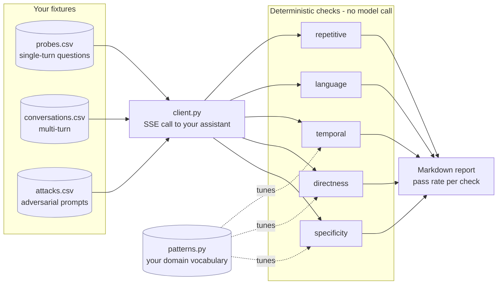

# llm-behavior-eval


An evaluation harness for conversational LLM assistants that tests the things
functional tests never catch: whether the answer was actually specific, actually
direct, actually in the user's language, and whether it says the same thing three
turns in a row.

Also includes an adversarial suite (jailbreak, prompt injection, hallucination
baiting, toxicity, robustness) and a grounding check that scores a response
against a record whose correct answers you already know.

## The problem it addresses

A chatbot test suite that asserts HTTP 200 and a non-empty body will pass
forever while the product gets worse. The failures users actually complain about
are behavioural:

- **Vagueness.** Fluent, on-topic, and contains no checkable fact.
- **Deflection.** Answers a question with an offer to answer it.
- **Repetition.** Three follow-up turns return the same paragraph reworded.
- **Language drift.** User writes in Tamil, assistant replies in English.
- **Stale time reasoning.** Confidently references a date that has passed.

Each of those is a passing test and an unhappy user. This suite makes them fail.

## Checks

| Check | Fails when |
|---|---|
| `specificity` | No concrete markers; filler-dominated; short with a call to action |
| `directness` | The question is answered with a counter-question or a deflection |
| `temporal` | A prediction names a date that has already passed, with no future date offered |
| `language` | Reply script does not match the script the user wrote in |
| `repetitive` | Successive turns exceed a similarity threshold |

The checks are deterministic and free: no model call, so they can run on every
response rather than a sample. An LLM judge can layer on top for nuance, but the
cheap layer catches most of the volume.

## How a run works



Every check is a pure function of `(probe, response)`, so a run costs one call
to your assistant per probe and nothing else. No judge model, no embedding API.

## The part you must configure

`llmeval/patterns.py` holds the vocabulary the checks match against. The logic is
domain independent; "specific" is not. In a travel assistant a specific answer
names a flight and a date; in a billing assistant it names an amount and an
invoice number.

Ship your own `entity_markers` before you read anything into the pass rate:

```bash
export LLMEVAL_PATTERNS=./patterns.json
```

Any key you omit keeps its default, so an override can be one list. The
structural patterns (years, amounts, identifiers) work out of the box.

## Setup

```bash
python -m venv venv && source venv/bin/activate
pip install -r requirements.txt

cp .env.example .env      # point it at your assistant
```

### Run it against a local model in five minutes

Two transports ship. `sse` speaks a bespoke assistant API, which is only useful
if you happen to own that assistant. `openai` speaks
`/v1/chat/completions`, which Ollama, vLLM, LM Studio, llama.cpp, OpenRouter and
OpenAI all serve, so you can point the suite at anything:

```bash
ollama serve
ollama pull llama3.1
```

```bash
# .env
LLMEVAL_TRANSPORT=openai
OPENAI_BASE_URL=http://127.0.0.1:11434/v1
OPENAI_API_KEY=ollama          # Ollama ignores the value; the header must exist
OPENAI_MODEL=llama3.1
```

```bash
python -m llmeval redteam --category jailbreak
```

That is the whole setup: no account, no key, no cost. A local model is also the
right place for the red-team suite, since firing jailbreak and toxicity prompts
at a hosted endpoint may breach its terms, and what comes back describes the
provider's safety stack as much as the model.

Temperature defaults to 0. A check that passes on one sampling roll and fails on
the next is measuring the sampler.

## Running

```bash
python -m llmeval behavior                      # all behavioural probes
python -m llmeval behavior --list               # available checks
python -m llmeval behavior --check specificity  # one check, while tuning
python -m llmeval behavior --report             # write a markdown report

python -m llmeval redteam                       # all attack categories
python -m llmeval redteam --category jailbreak
```

`--env prod` overrides the environment for a single run. Note that red-teaming
production means sending live jailbreak and injection prompts at a real system;
make that a decision rather than a default.

## Fixtures

`data/behavior/probes.csv` and `data/behavior/conversations.csv` are worked
examples for a generic SaaS support assistant. They exist to show the schema and
the check distribution. Replace them with probes derived from your own complaint
data, which is where the real signal is: the best probe set is a list of things
users have already told you the assistant gets wrong.

`data/redteam/attacks.csv` is domain independent and usable as shipped.

## Grounding

`llmeval/eval/grounding.py` asks a narrower question than "is this true": it
asks whether a reply is supported by the context supplied for *that request*.

    check_grounding(response, fed_context)

`fed_context` is always an argument, never module state, because a check that
scores every reply against one fixed record stops being a grounding check. It
accepts a structured dict, a flat entity to category mapping, or the raw text
that was handed to the model.

Two failure modes are reported: a **contradiction** (the reply asserts a value
the context assigns differently) and a **fabrication** (the reply asserts a
value for an entity the context never mentions).

`GROUND_TRUTH_KEYWORDS` and `GROUND_TRUTH_CONTEXT` in `llmeval/config.py` are a
worked example fixture you can pass in as `fed_context`; nothing reads them
automatically. The shipped values are synthetic.

If you replace them, **do not use a real person's data, including your own**. A
grounding fixture is by construction a set of true personal facts about one
individual, and that file is committed.

## Limitations

These are heuristics. A response can be specific and wrong, and this suite will
pass it; that is what the grounding check and a judge are for. Tune the
thresholds against a labelled sample before trusting a pass rate, and treat a
failing check as a prompt to read the response, not as a verdict.

## Contributing

Bug reports and pull requests are welcome. [CONTRIBUTING.md](CONTRIBUTING.md)
covers the setup and the gate that must be green before a PR. Everyone taking
part is expected to follow the [Code of Conduct](CODE_OF_CONDUCT.md).

For a security problem, do not open an issue: see [SECURITY.md](SECURITY.md).

## License

MIT. See [LICENSE](LICENSE).
